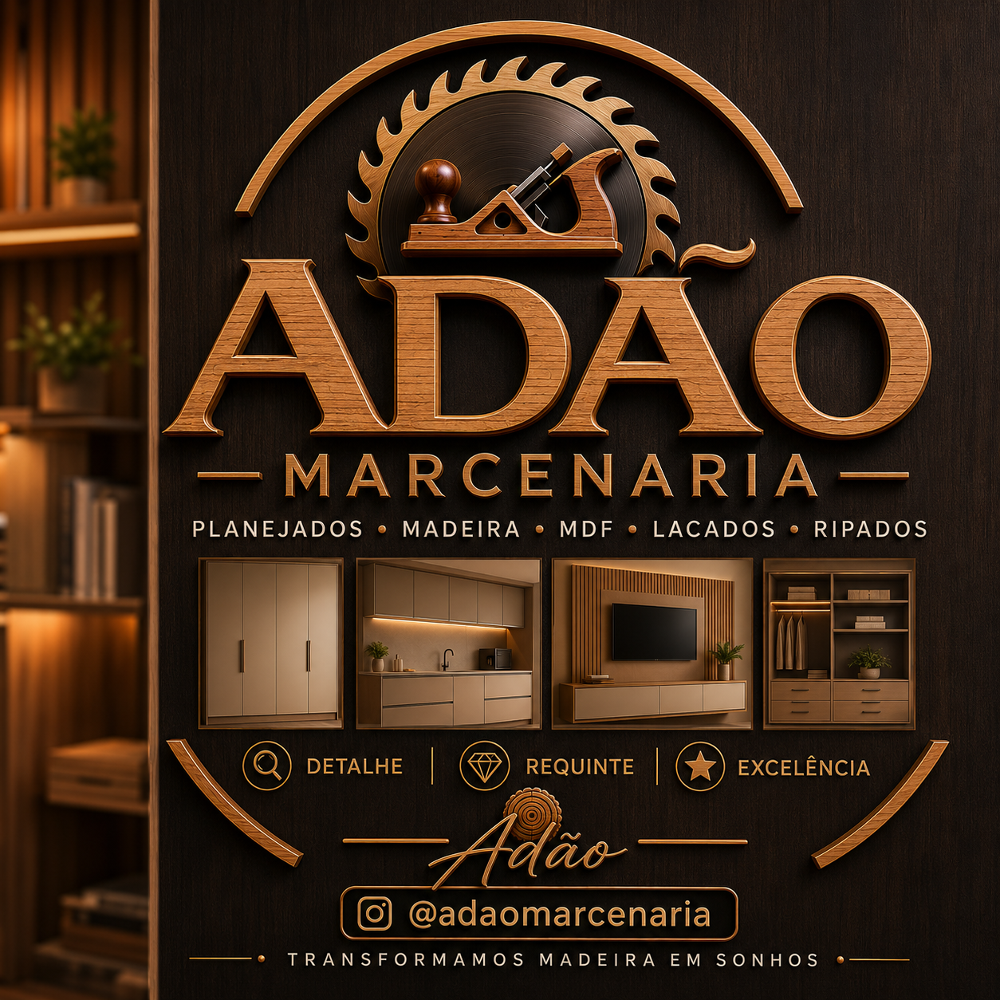
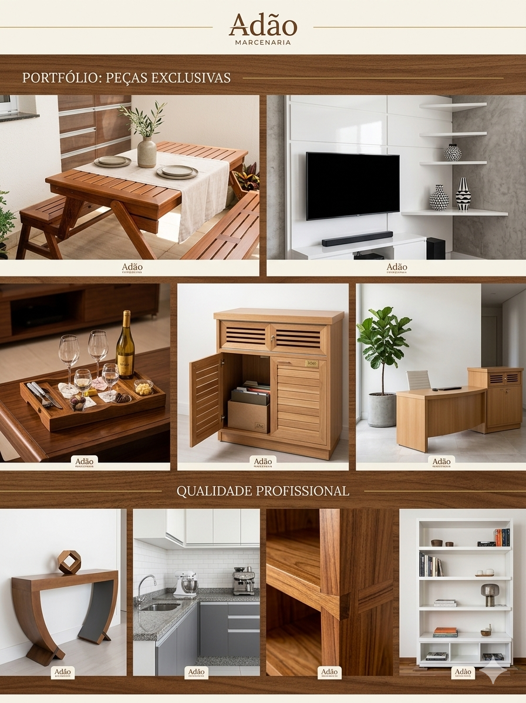

<!DOCTYPE html>
<html lang="pt-BR">

<head>
    <meta charset="UTF-8">
    <meta name="viewport" content="width=device-width, initial-scale=1.0">

    <title>Adão Marcenaria - Móveis Planejados</title>

    <!-- Framework W3.CSS -->
    <link rel="stylesheet" href="https://www.w3schools.com/w3css/4/w3.css">

    <!-- Font Awesome -->
    <link rel="stylesheet"
        href="https://cdnjs.cloudflare.com/ajax/libs/font-awesome/4.7.0/css/font-awesome.min.css">

    
</head>

<body class="w3-light-grey">

    <!-- SIDEBAR -->
    <nav class="w3-sidebar w3-bar-block w3-card adao-marrom-escuro"
        style="width:200px" id="mySidebar">

        

            

            <h5>Adão Marcenaria</h5>
            <a href="https://www.instagram.com/vsmmarcenaria/" target="_blank">@vsmmarcenaria
</a>

        

        <button onclick="switchSection('home')"
            class="w3-bar-item w3-button w3-hover-amber">
            <i class="fa fa-home"></i> HOME
        </button>

        <button onclick="switchSection('parceiros')"
            class="w3-bar-item w3-button w3-hover-amber">
            <i class="fa fa-handshake-o"></i> PARCEIROS
        </button>

        <button onclick="switchSection('faq')"
            class="w3-bar-item w3-button w3-hover-amber">
            <i class="fa fa-question-circle"></i> FAQ
        </button>

    </nav>

    <!-- CONTEÚDO PRINCIPAL -->
    

        <!-- ===================================================== -->
        <!-- HOME -->
        <!-- ===================================================== -->

        <section id="home" class="pagina">

            <header class="w3-container adao-marrom-escuro w3-center w3-padding-32">

                <h1 class="w3-jumbo">Adão Marcenaria</h1>

                

                    <i>Transformamos projetos em sonhos realizados.</i>
                

            </header>

            <main class="w3-content w3-container w3-padding-64" style="max-width:900px">

                <h2 class="w3-center adao-texto-marrom">
                    NOSSA HISTÓRIA
                </h2>

                

                    A Adão Marcenaria é uma empresa especializada em móveis
                    planejados e projetos sob medida. Atendemos a você cliente final, 
                    arquitetos, engenheiros que zelam por compromisso com qualidade, 
                    acabamento e prazo. Há mais de 30 anos no mercado. Nosso objetivo 
                    é criar ambientes modernos, funcionais e elegantes, sempre
                    valorizando os detalhes, o requinte e a excelência em cada
                    projeto realizado.
                

                <!-- Imagem Principal -->

                <section class="w3-center w3-margin-top">

                    

                </section>

                <!-- Missão Visão Valores -->

                <section class="w3-row-padding w3-margin-top">

                    <section class="w3-third">

                        

                            <h3 class="adao-texto-marrom">
                                Missão
                            </h3>

                            

                                Produzir móveis planejados de qualidade,
                                atendendo às necessidades de cada cliente.
                            

                        

                    </section>

                    <section class="w3-third">

                        

                            <h3 class="adao-texto-marrom">
                                Visão
                            </h3>

                            

                                Ser referência em móveis planejados,
                                destacando-se pela excelência, cumprimento de prazos e satisfação do cliente.
                            

                        

                    </section>

                    <section class="w3-third">

                        

                            <h3 class="adao-texto-marrom">
                                Valores
                            </h3>

                            

                                Compromisso, honestidade, qualidade,
                                pontualidade e respeito ao cliente.
                            

                        

                    </section>

                </section>

            </main>

            <footer class="w3-container adao-marrom-escuro w3-center w3-padding-32">

                

                    <i class="fa fa-envelope"></i>
                    lopes.35@hotmail.com
                

                

                    <i class="fa fa-phone"></i>
                    (11) 95234-9149
                

                

                    <a href="https://instagram.com/vsmmarcenaria"
                        target="_blank"
                        class="w3-text-white">
                        <i class="fa fa-instagram"></i>
                        @vsmmarcenaria
                    </a>
                

                

                    Desenvolvido por Milena © 2026
                

            </footer>

        </section>

        <!-- ===================================================== -->
        <!-- PARCEIROS -->
        <!-- ===================================================== -->

        <section id="parceiros" class="pagina" style="display:none">

            <header class="w3-container adao-marrom-escuro w3-center w3-padding-32">

                <h1 class="w3-jumbo">Adão Marcenaria</h1>

                

                    <i>Transformamos projetos em sonhos.</i>
                

            </header>

            <main class="w3-container w3-content w3-padding-64">

                <h2 class="w3-center adao-texto-marrom">
                    NOSSOS PARCEIROS
                </h2>

                <section class="w3-row-padding w3-margin-top">

                    <section class="w3-half">

                        

                            

                            <h4>Fornecedor MDF</h4>

                        

                    </section>

                    <section class="w3-half">

                        

                            

                            <h4>Fornecedor Ferragens</h4>

                        

                    </section>

                </section>

            </main>

            <footer class="w3-container adao-marrom-escuro w3-center w3-padding-32">

                
lopes.35@hotmail.com

                
(11) 95234-9149 / (11) 94118-3533

                
São Paulo - SP

            </footer>

        </section>

        <!-- ===================================================== -->
        <!-- FAQ -->
        <!-- ===================================================== -->

        <section id="faq" class="pagina" style="display:none">

            <header class="w3-container adao-marrom-escuro w3-center w3-padding-32">

                <h1 class="w3-jumbo">Adão Marcenaria</h1>

                

                    <i>Transformamos projetos em sonhos.</i>
                

            </header>

            <main class="w3-container w3-content w3-padding-64">

                <h2 class="w3-center adao-texto-marrom">
                    PERGUNTAS FREQUENTES
                </h2>

                

                    <header class="w3-container adao-marrom-claro">
                        <h4>Quais locais vocês atendem?</h4>
                    </header>

                    

                        

                            Atendemos principalmente a região de São Paulo, mas estamos abertos a projetos em outras localidades mediante análise.
                        

                    

                    
                    

                    <header class="w3-container adao-marrom-claro">
                        <h4>Qual o prazo de entrega?</h4>
                    </header>

                    

                        

                            O prazo médio varia entre 30 e 45 dias,
                            dependendo do projeto.
                        

                    

                

                

                    <header class="w3-container adao-marrom-claro">
                        <h4>Vocês fazem orçamento?</h4>
                    </header>

                    

                        

                            Sim. O orçamento é realizado após a análise
                            das medidas e necessidades do cliente.
                        

                    

                

                

                    <header class="w3-container adao-marrom-claro">
                        <h4>Quais materiais são utilizados?</h4>
                    </header>

                    

                        

                            Trabalhamos com MDF, lâminados, madeira de lei e outros materiais
                            de alta qualidade para móveis planejados.
                        

                    

                

            </main>

            <footer class="w3-container adao-marrom-escuro w3-center w3-padding-32">

                
lopes.35@hotmail.com

                
(11) 95234-9149 / (11) 94118-3533

                 
São Paulo - SP

            </footer>

        </section>

    

    <!-- JAVASCRIPT -->
    

</body>
</html>
